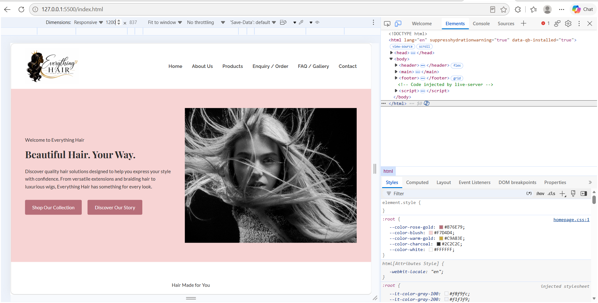
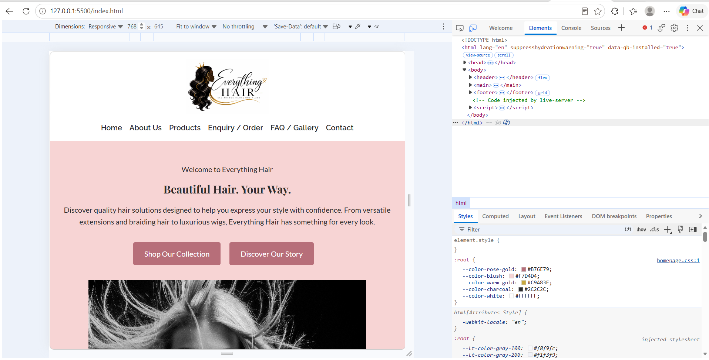
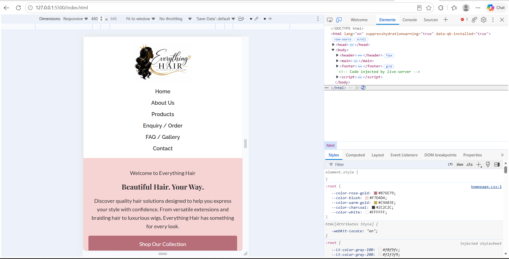
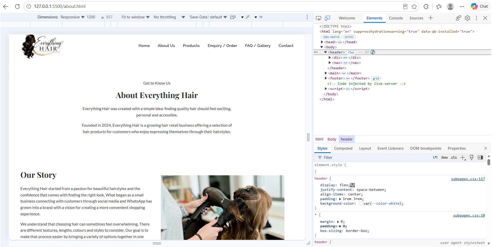
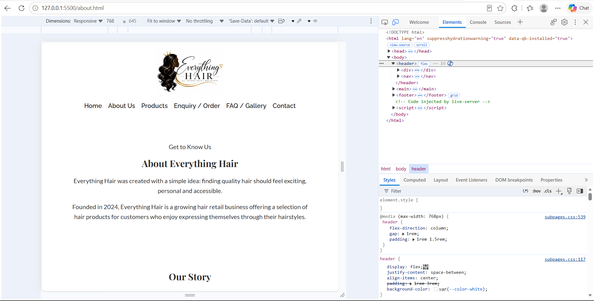
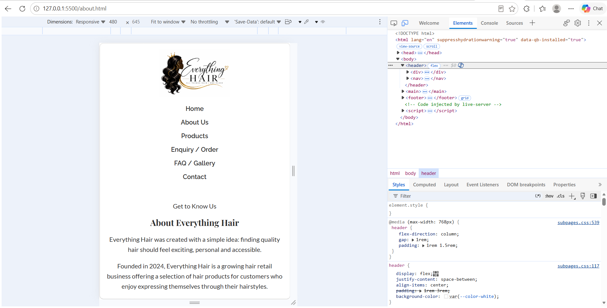

# Everything Hair

## Web Development Project

Everything Hair is a small online hair retail business created as a web development project for the WEDE5020POE Web Development Project. The website is being developed as a professional online presence for a business that specialises in quality hair products and personalised hair solutions.

The project is being developed in three stages:

- Part 1: Building the Foundation
- Part 2: Designing the Visuals
- Part 3: Adding Functionality and SEO

The current version of this repository reflects Part 2, which builds on the Part 1 foundation by adding CSS styling, layout, colour and typography and responsive design across all pages.

---

# 1. Student Information

**Student Name:**   Hitekani
**Student Number:**  St10486196
**Subject:** Web Development Project  
**Subject Code:** WEDE5020POE  
**Institution:** The Independent Institute of Education (IIE)  
**Project:** Everything Hair  
**Assessment:** Portfolio of Evidence (POE)  
**Part:** Part 2 – Designing the Visuals  

---

# 2. Project Overview

Everything Hair is a growing online retail business specialising in hair products and hair solutions.

The business was established in 2024 and focuses on providing customers with a range of hair products suitable for different styles, occasions and personal preferences.

The product range includes:

- Human hair bundles
- Synthetic braiding extensions
- French curl hair
- Frontal laces
- Pre-plugged frontal closures
- Custom wigs

The business currently relies mainly on social media and WhatsApp to communicate with customers and handle enquiries. Although these platforms provide a useful way of communicating with customers, a dedicated website provides an opportunity to present the business and its products in a more organised and professional way.

The purpose of the Everything Hair website is therefore to create a central online location where customers can learn more about the business, browse its products, ask questions and make enquiries.

The website is being developed using HTML5, CSS3 and JavaScript. Visual Studio Code is being used as the development environment, while Git and GitHub are being used for version control.

---

# 3. Project Purpose

The purpose of the project is to develop a professional, user-friendly and responsive website for Everything Hair.

The website should make it easier for customers to:

- Learn about Everything Hair
- Browse available products
- Understand the different hair options
- Ask questions
- Make product or order enquiries
- Find contact information
- Locate the business
- Access important frequently asked questions

The website will also provide a foundation for future e-commerce functionality.

---

# 4. Target Audience

The primary target audience for Everything Hair includes:

- Women between approximately 18 and 45 years old
- Customers looking for hair extensions
- Customers interested in wigs
- Customers interested in protective hairstyles
- Hair stylists
- Customers purchasing hair for personal use
- Customers purchasing hair for professional use

The website is designed to be accessible to customers with different levels of knowledge about hair products. Product information should therefore be clear and easy to understand.

---

# 5. Website Goals and Objectives

## 5.1 Main Goal

The main goal of the website is to establish a professional online presence for Everything Hair while making it easier for customers to discover products and communicate with the business.

## 5.2 Objectives

The website aims to:

1. Increase brand visibility.
2. Present products in a clear and organised manner.
3. Improve the customer experience.
4. Make product enquiries easier to submit.
5. Reduce reliance on manual communication for basic enquiries.
6. Create a foundation for future online purchasing.
7. Encourage customers to interact with the business.
8. Provide clear contact and location information.

---

# 6. Key Performance Indicators (KPIs)

The proposed website KPIs include:

| KPI | Target |
|---|---|
| Online sales | Increase online sales by approximately 30% within six months |
| Email subscribers | Reach approximately 500 subscribers |
| Website traffic | Monitor growth in website visitors |
| Conversion rate | Monitor the percentage of visitors who complete a desired action |
| Average order value | Monitor the average amount spent per order |
| Customer retention | Monitor repeat customers |
| Enquiries | Monitor the number of product and service enquiries |

These indicators can be reviewed once the website is operational and real user data becomes available.

---

# 7. Website Pages

The website consists of six main pages.

| Page | File | Purpose |
|---|---|---|
| Home | `index.html` | Introduces the business and directs visitors to important areas of the website |
| About Us | `about.html` | Provides information about Everything Hair, its story, mission and vision |
| Products | `products.html` | Displays the main product categories |
| Enquiry / Order | `enquiry.html` | Allows customers to submit product and order enquiries |
| FAQ / Gallery | `faq.html` | Provides frequently asked questions and a visual gallery |
| Contact | `contact.html` | Provides contact details, location information and a contact form |

---

# 8. Website Structure

The planned website structure is:

Everything Hair
│
├── Home
│
├── About Us
│
├── Products
│   ├── Human Hair Bundles
│   ├── Synthetic Braiding Extensions
│   ├── French Curl Hair
│   ├── Frontal Laces
│   ├── Pre-Plugged Frontal Closures
│   └── Custom Wigs
│
├── Enquiry / Order
│
├── FAQ / Gallery
│
└── Contact
    ├── Location 1
    └── Location 2

# 9. Sitemap

Everything Hair
│
├── Home
│
├── About Us
│
├── Products
│   ├── Human Hair Bundles
│   ├── Synthetic Braiding Extensions
│   ├── French Curl Hair
│   ├── Frontal Laces
│   ├── Pre-Plugged Frontal Closures
│   └── Custom Wigs
│
├── Enquiry / Order
│
├── FAQ / Gallery
│
└── Contact
    ├── Contact Information
    ├── Location 1
    └── Location 2

# 10. File and Folder Structure

Everything-Hair/
│
├── index.html
├── about.html
├── products.html
├── enquiry.html
├── faq.html
├── contact.html
│
├── css_assets/
│   ├── homepage.css
│   └── subpages.css
│
├── js_assets/
│   ├── homepage.js
│   └── subpages.js
│
├── _images/
│
├── screenshots/
│
├── README.md
│
└── WEDE Proposal.docx

# 11. Design Aesthetic (Part 2)

## 11.1 Colour Palette

- Rose Gold `#B76E79` — primary accent, buttons, hover states
- Soft Blush `#F7D4D4` — backgrounds, section highlights
- Warm Gold `#C9A83E` — secondary accent, borders, dividers
- Charcoal `#2C2C2C` — body text, footer background

## 11.2 Typography

- Playfair Display — headings (h1, h2)
- Raleway — subheadings (h3)
- Lato — body text

---

# 12. Changelog

- 2026-09-16 — Added design aesthetic section to README (colour palette, typography)
- 2026-09-16 — Added References section to README
- 2026-09-17 — Added colour variables, CSS reset and base typography to homepage.css and subpages.css
- 2026-09-17 — Added hero-content and hero-image classes to index.html; added layout styling for nav, hero, featured products, why-choose-us and footer in homepage.css
- 2026-09-17 — Added layout styling for about, products, enquiry, contact and faq pages in subpages.css
- 2026-09-18 — Added responsive breakpoints for tablet and mobile to homepage.css and subpages.css
- 2026-09-18 — Added home and about page screenshots to README

---

# 13. References

Google Fonts (2024) Playfair Display, Raleway, Lato, Great Vibes. Available at: https://fonts.google.com/ (Accessed: 2 August 2026).

HostAfrica (2024) Web Hosting Pricing. Available at: https://www.hostafrica.co.za/ (Accessed: 2 August 2026).

HubSpot (2024) E-commerce Website Best Practices. Available at: https://blog.hubspot.com/marketing/ecommerce-website-best-practices (Accessed: 2 August 2026).

Mozilla Developer Network (MDN) (2024) HTML: HyperText Markup Language. Available at: https://developer.mozilla.org/en-US/docs/Web/HTML (Accessed: 2 August 2026).

PayFast (2024) Payment Gateway for South Africa. Available at: https://www.payfast.co.za/ (Accessed: 2 August 2026).

Shopify (2024) How to Start an Online Store. Available at: https://www.shopify.com/blog/how-to-start-online-store (Accessed: 2 August 2026).

Small Business Administration (2024) Create a Marketing Plan. Available at: https://www.sba.gov/business-guide/plan-your-business/marketing-sales (Accessed: 2 August 2026).

The Independent Institute of Education (2026) WEDE5020POE: Web Development Project Guidelines. [Course Document]. The Independent Institute of Education (Pty) Ltd.

W3Schools (2024) HTML Tutorial. Available at: https://www.w3schools.com/html/ (Accessed: 2 August 2026).

# 14. Responsive Screenshots

Screenshots below show the Everything Hair website tested at desktop, tablet and mobile widths using browser developer tools.

## 14.1 Home Page

**Desktop (1200px)**

**Tablet (768px)**

**Mobile (480px)**

## 14.2 About Page

**Desktop (1200px)**

**Tablet (768px)**

**Mobile (480px)**
